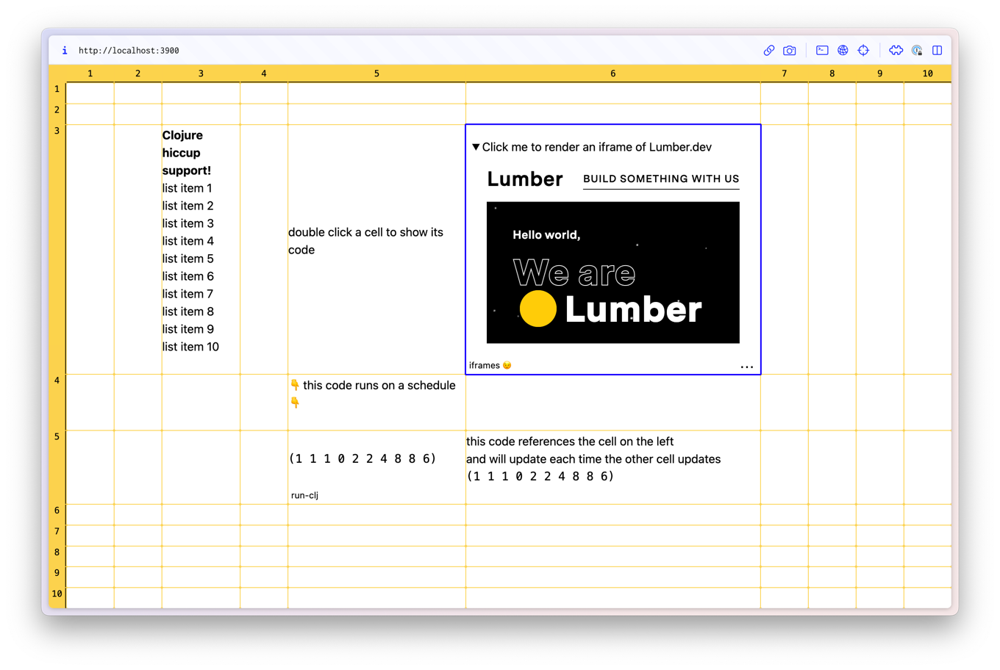

# Tesserae



### What is it? 
Currently, it's a spreadsheet where cells:
1. run user Clojure code async and in parallel
2. reactively re-run when upstream cells update
3. can run on schedule (e.g. "every 5 seconds")
4. can render hiccup, VegaLite and other UI elements like buttons etc.


## Status

In active development and used every day in production at [Lumber](https://lumber.dev/).
Tesserae acts as a dashboard to provide overviews over employee utilization, project hours and finances.
It also acts as a slack notifier sending daily project summaries to employees.

That said, the current code is sparsely documented.

## Demo

A few incompatible changes have landed since the demo code has been pushed.
These are minor changes overall but we're not currently focused on maintaining demo data.   
An earlier commit should work and provide a similar experience to master.

Try this in your deps.edn and follow the steps below: 

```clojure
lumberdev/tesserae {:git/url "https://github.com/lumberdev/tesserae"
                    :sha     "fcfabb928a44ba72b56c091725c3b564614eca91"}
```

Run
```clojure
clojure -X:demo:dev/cljs tesserae.serve/demo
```

then visit http://localhost:3900

## Dev

```
npm install
```

Start a clojure repl with the :dev/cljs alias.
Go to `tesserae.serve`, load the file. Shadow-cljs should start up.
Run `(-main)` or `(mount/start)` to boot up the server, db, listeners etc.

### Extending Tesserae

**Injecting user code into the eval context:**  
Custom namespaces and bindings can be added on startup using mount args.  
The values of `namespaces` map, if they're symbols, have to be on the classpath and will automatically be required.  
The values of the `bindings` map will be required and resolved if they are fully qualified symbols
or otherwise left as their identity.  

For example:

```clojure
(-> (mount/with-args
      {:tesserae.db/dir          "folder-in-project-root/data/datalevin/db"
       :tesserae.eval/namespaces {'walk 'clojure.walk
                                  'my-ns {'my-fn (fn [x] (println :foo x))}}
       :tesserae.eval/bindings   {'println `println
                                  'debug   (fn [& args] (apply println ::dbg args))}})
    (mount/start))
```

## Status
Used internally in prod at [Lumber](https://lumber.dev/) but also very alpha!

## Contribute
- improve code entering experience, e.g. by adding codemirror with clojure mode
- cell functions and UI plugin system. Users should be able to extend Tesserae with their own code.
- UI additions: multiple sheets, search, users, permissions... the whole shebang!

## Thanks
As of this commit Tesserae is a lean **1766 LoC**!
This made possible largely thanks to Hyperfiddle's [Electric](https://github.com/hyperfiddle/electric),
Borkdude's [sci](https://github.com/babashka/sci) and
Juji's [Datalevin](https://github.com/juji-io/datalevin).

## License

Copyright © 2023 Dennis Heihoff, Lumber LLC


